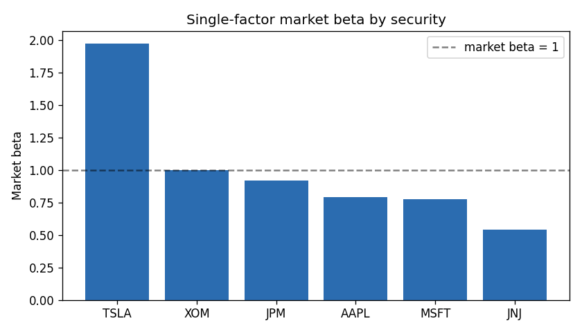
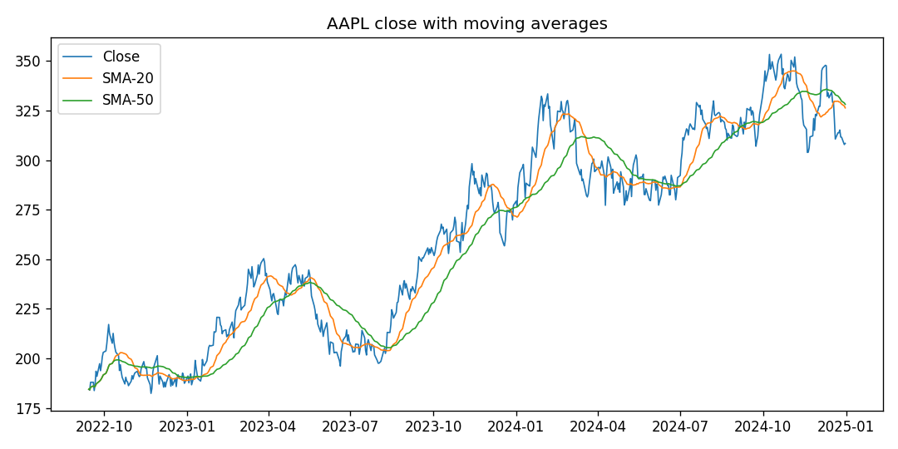

# 📈 Equities ELT & Analytics Warehouse

A production-style **ELT platform** that ingests daily market data, models it with layered **SQL** inside a **DuckDB** warehouse, **gates every run on data-quality checks**, derives an analytics mart (single-factor betas), and exports columnar **Parquet** — orchestrated on a schedule with **Airflow**.

[](https://github.com/danielduongg/equities-warehouse-etl/actions)

> **Reproducible by design:** ships with a synthetic OHLCV generator (a shared market factor makes tickers co-move like real equities), so the whole pipeline runs with no API keys. One-line switch to `yfinance` documented below.

## What makes it more than a toy

- **Incremental loading** — appends only new rows per ticker; re-runs are fully **idempotent** (staging de-dupes by grain). `--full-refresh` rebuilds from scratch.
- **Data-quality gate** — a mini Great-Expectations (`dq.py`) runs after transforms and **fails the pipeline** on nulls, non-positive prices, duplicate grain, insane returns, or orphaned securities. Same checks run in CI.
- **Layered SQL models** — `staging → marts` (dimension + fact) with window functions for returns, SMA-20/50, annualized volatility, RSI.
- **Analytical mart** — a single-factor **market-beta** model (`factor.py`) regresses each security's returns on the equal-weight market.
- **Parquet export**, **Airflow DAG**, **pytest**, **GitHub Actions CI**, **Dockerfile**.

## Architecture
```
            Python                         SQL models (DuckDB)            Python/SQL
 extract ─▶ raw.prices ─(incremental)─▶ staging.stg_prices ─▶ marts.dim_security
 (gen/API)                                                   ─▶ marts.fct_daily_metrics
                                                                     │
                          data-quality gate (dq.py) ◀────────────────┤
                          factor model  ─▶ marts.fct_factor_exposure ─┘
                                                                     │
                          Airflow (daily) schedules it   ─▶  Parquet export + analytics
```

## Warehouse schema

| Table | Grain | Notable columns |
|---|---|---|
| `staging.stg_prices` | ticker × day | cleaned, de-duped OHLCV |
| `marts.dim_security` | security | `security_id`, ticker, name, sector |
| `marts.fct_daily_metrics` | ticker × day | `daily_return`, `sma_20/50`, `ann_vol_20`, `rsi_14` |
| `marts.fct_factor_exposure` | security | `beta`, `alpha_daily`, `ann_alpha` |

## Sample output

Market betas behave like the real world — high-beta growth names on top, defensives at the bottom:

| Ticker | Beta | Ann. alpha |
|---|---|---|
| TSLA | 1.97 | −0.37 |
| XOM | 1.00 | +0.44 |
| JPM | 0.92 | −0.02 |
| AAPL | 0.79 | −0.01 |
| MSFT | 0.78 | +0.11 |
| JNJ | 0.54 | −0.15 |




## Quickstart
```bash
pip install -r requirements.txt
python run_pipeline.py --full-refresh    # extract → load → models → DQ gate → factors → parquet
python run_pipeline.py                    # incremental (idempotent)
python analytics.py                       # top movers, correlations, charts
pytest -q                                 # transform + data-quality + factor tests
```
The warehouse path is configurable via `EQUITIES_DB` (defaults to `data/warehouse.duckdb`).

## Using real market data
Swap the body of `extract()` for a `yfinance` pull reshaped to `ticker, date, open, high, low, close, volume`; everything downstream runs unchanged.

## Tech
Python · DuckDB · SQL (windows, dimensional modeling) · Airflow · Parquet · pytest · Docker · GitHub Actions

## Layout
```
├── extract.py          # OHLCV generator (or yfinance)
├── warehouse.py        # DuckDB helpers (full + incremental load)
├── run_pipeline.py     # ELT orchestrator w/ DQ gate + factors + parquet
├── dq.py               # data-quality checks (pipeline gate + CI)
├── factor.py           # single-factor market-beta mart
├── analytics.py        # queries + charts
├── airflow_dag.py      # daily orchestration
├── sql/                # staging + marts + analytics SQL
├── test_*.py           # pytest suite
└── .github/workflows/ci.yml
```
